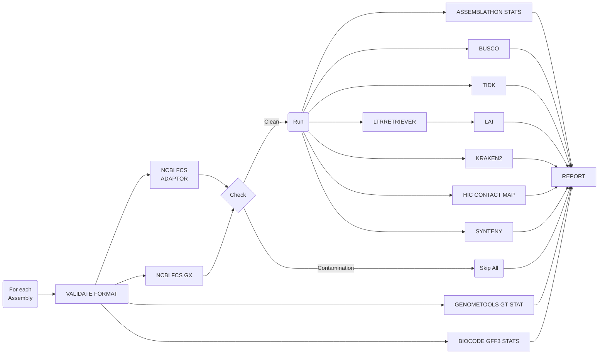

# AssemblyQC

- [AssemblyQC](#assemblyqc)
  - [Introduction](#introduction)
  - [Pipeline Flowchart](#pipeline-flowchart)
  - [Running the Pipeline](#running-the-pipeline)
    - [Minimal Test Run](#minimal-test-run)
    - [Quick Start for Plant \& Food Research Users](#quick-start-for-plant--food-research-users)
    - [Post-run clean-up](#post-run-clean-up)
  - [AssemblyQC Report](#assemblyqc-report)
  - [Known Issues](#known-issues)
  - [Contributors](#contributors)
  - [Citations](#citations)

## Introduction

AssemblyQC is a [NextFlow](https://www.nextflow.io/docs/latest/index.html) pipeline which evaluates assembly quality with well-established tools and presents the results in a unified html report. The tools are shown in the [Pipeline Flowchart](#pipeline-flowchart) and their version are listed in [CITATIONS.md](./CITATIONS.md).

## Pipeline Flowchart



- [FASTA VALIDATION](https://github.com/GallVp/fasta_validator)
- [GFF3 VALIDATION](https://github.com/genometools/genometools)
- [ASSEMBLATHON STATS](https://github.com/PlantandFoodResearch/assemblathon2-analysis/blob/a93cba25d847434f7eadc04e63b58c567c46a56d/assemblathon_stats.pl): Assembly statistics
- [GENOMETOOLS GT STAT](https://github.com/genometools/genometools)/[BIOCODE GFF3 STATS](https://github.com/jorvis/biocode): Annotation statistics
- [NCBI FCS ADAPTOR](https://github.com/ncbi/fcs): Adaptor contamination pass/fail
- [NCBI FCS GX](https://github.com/ncbi/fcs): Foreign organism contamination pass/fail
- [BUSCO](https://gitlab.com/ezlab/busco/-/tree/master): Gene-space completeness estimation
- [TIDK](https://github.com/tolkit/telomeric-identifier): Telomere repeat identification
- [LAI](https://github.com/oushujun/LTR_retriever/blob/master/LAI): Continuity of repetitive sequences
- [LAI::LTRRETRIEVER](https://github.com/oushujun/LTR_retriever): Repeat identification
- [KRAKEN2](https://github.com/DerrickWood/kraken2): Taxonomy classification
- [HIC CONTACT MAP](https://github.com/igvteam/juicebox-web): Alignment and visualisation of HiC data
- SYNTENY: Synteny analysis using [MUMMER](https://github.com/mummer4/mummer) and [CIRCOS](http://circos.ca/documentation/)

## Running the Pipeline

See the [tutorials](./docs/README.md) for detailed instructions on how to use the pipeline. The pipeline can be executed on a range of executors including AWS, LSF, Slurm, and others supported by [NextFlow](https://www.nextflow.io/docs/latest/executor.html#executors).

### Minimal Test Run

```bash
nextflow main.nf \
  -profile local,docker \
  -c conf/test_minimal.config
```

### Quick Start for Plant & Food Research Users

To run the pipeline, first edit the nextflow.config. The following parameters must be checked and modified accordingly:

- target_assemblies
- assembly_gff3
- assemblathon_stats::n_limit
- ncbi_fcs_adaptor::empire
- ncbi_fcs_gx::tax_id
- busco::lineage_datasets
- busco::mode
- tidk::repeat_seq
- hic::paired_reads
- synteny::assembly_seq_list
- synteny::xref_assemblies

Then, the pipeline should be posted to Slurm for execution with the following command:

```bash
sbatch ./pfr_assemblyqc
```

### Post-run clean-up

The intermediary files produced by the pipeline are stored in the "work" folder. After running the pipeline, if you wish to clean up the logs and "work" folder, run the following command:

```bash
./cleanNXF.sh
```

## AssemblyQC Report

Once the pipeline has finished execution, the results folder specified in the config file should contain a file named 'report.html'. The 'report.html' is a standalone file for all the modules except HiC and Kraken2. Thus, if you move the report to another folder, make sure to also move the 'hic' folder and the 'kraken2' folder with it.

## Known Issues

- On its first run, the pipeline has to download a lot many software containers. This download may fail. If it happens, resume the pipeline and it should be able to download the required containers.
- The pipeline may fail more frequently at building singularity containers when the temporary directory is not the system "/tmp" directory.

## Contributors

Cecilia Deng [@CeciliaDeng](https://github.com/CeciliaDeng), Chen Wu [@christinawu2008](https://github.com/christinawu2008), Jason Shiller [@jasonshiller](https://github.com/jasonshiller), Ken Smith [@hzlnutspread](https://github.com/hzlnutspread), Marcus Davy [@mdavy86](https://github.com/mdavy86), Ross Crowhurst [@rosscrowhurst](https://github.com/rosscrowhurst), Susan Thomson [@cflsjt](https://github.com/cflsjt), Ting-Hsuan Chen [@ting-hsuan-chen](https://github.com/ting-hsuan-chen), Usman Rashid [@GallVp](https://github.com/GallVp)

## Citations

For a comprehensive list of references and versions for the tools, see [CITATIONS.md](./CITATIONS.md).

> Rashid, U., Wu, C., Shiller, J., Smith, K., Crowhurst, R., Davy, M., Chen, T.-H., Thomson, S., & Deng, C. (2024). AssemblyQC: A NextFlow pipeline for evaluating assembly quality (1.3). Zenodo. https://doi.org/10.5281/zenodo.10647870
