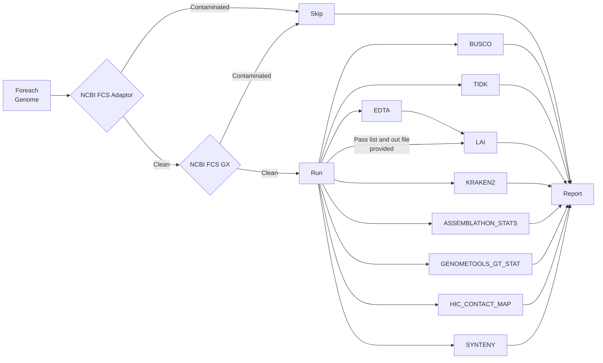

# AssemblyQC

## Table of Contents

- [AssemblyQC](#assemblyqc)
  - [Table of Contents](#table-of-contents)
  - [Introduction](#introduction)
  - [Pipeline Flowchart](#pipeline-flowchart)
  - [Installation](#installation)
  - [Running the Pipeline](#running-the-pipeline)
    - [Post the NextFlow Process to Slurm](#post-the-nextflow-process-to-slurm)
    - [Run Interactively](#run-interactively)
    - [Post-run clean-up](#post-run-clean-up)
  - [Getting sample data](#getting-sample-data)
  - [Known Issues](#known-issues)
  - [Software Versions](#software-versions)
  - [Future Tools](#future-tools)

## Introduction

Welcome to AssemblyQC. This Nextflow pipeline evaluates assembly quality with well established tools and presents the results in a unified html report. The tools are shown in the [Pipeline Flowchart](#pipeline-flowchart) and their version are listed under [Software Versions](#software-versions).

## Pipeline Flowchart



## Installation

1. Copy the Github repository URL and run the following in your target folder:

```bash
git clone https://github.com/PlantandFoodResearch/assembly_qc.git
```

2. Navigate into the project

```bash
cd assembly_qc/
```

## Running the Pipeline

To run the pipeline on a new genome, edit the nextflow.config. The following parameters must be checked and modified accordingly:

- genome_fasta
- genome_gff3
- ncbi_fcs_adaptor::empire
- ncbi_fcs_gx::tax_id
- busco::lineage_datasets
- tidk::repeat_seq
- hic::reads_folder
- hic::paired_reads

### Post the NextFlow Process to Slurm

```bash
cat << EOF > assembly_qc_slurm.sh
#!/bin/bash -e


#SBATCH --job-name asm_qc_${USER}
#SBATCH --time=14-00:00:00
#SBATCH --nodes=1
#SBATCH --ntasks=1
#SBATCH --cpus-per-task=1
#SBATCH --output asm_qc_${USER}.stdout
#SBATCH --error asm_qc_${USER}.stderr
#SBATCH --mem=1G

ml unload perl
ml apptainer/1.1
ml conda/22.9.0
ml nextflow/22.10.4

export NXF_CONDA_CACHEDIR=$(realpath ~/.conda)

srun nextflow main.nf -profile slurm -resume
EOF

chmod u+x ./assembly_qc_slurm.sh

sbatch ./assembly_qc_slurm.sh
```

You will now see a results folder which will contain a file named 'report.html' and can be viewed on the [powerPlant storage server](https://storage.powerplant.pfr.co.nz).

### Run Interactively

- Load the required modules:

```bash
ml unload perl
ml apptainer/1.1
ml conda/22.9.0
ml nextflow/22.10.4
```

- Set Conda cache directory:

```bash
export NXF_CONDA_CACHEDIR=$(realpath ~/.conda)
```

- Run the pipeline:

```bash
nextflow main.nf -profile slurm -resume
```

### Post-run clean-up

After running the pipeline, if you wish to clean up the logs and work folder, you can run the following:

```bash
./cleanNXF.sh
```

The work folder contains intermediary files produced by the pipeline tools.

## Getting sample data

In order to retrieve dummy data to test the pipeline with, run the following:

```bash
ml seqkit/0.7.0
mkdir test_data
cp /output/genomic/fairGenomes/Fungus/Neonectria/ditissima/sex_na/1x/assembly_rs324p/v1/Nd324_canupilon_all.sorted.renamed.fasta \
./test_data/test_data_original.fasta
seqkit sample -p 0.8 -s 33 ./test_data/test_data_original.fasta > ./test_data/test_data1.fasta
seqkit sample -p 0.8 -s 49 ./test_data/test_data_original.fasta > ./test_data/test_data2.fasta
seqkit sample -p 0.5 -s 22 ./test_data/test_data_original.fasta > ./test_data/test_data3.fasta
seqkit sample -p 0.5 -s 33 ./test_data/test_data_original.fasta > ./test_data/test_data4.fasta
rm ./test_data/test_data_original.fasta
cp /output/genomic/fairGenomes/Fungus/Neonectria/ditissima/sex_na/1x/assembly_rs324p/v1/augustus.hints.fixed.gff3 ./test_data/test_data1.gff3
cp /output/genomic/fairGenomes/Fungus/Neonectria/ditissima/sex_na/1x/assembly_rs324p/v1/augustus.hints.fixed.gff3 ./test_data/test_data2.gff3
cat ./test_data/test_data1.fasta | grep ">*chr" | head -3 | sed 's/>//g' | awk '{print $1, "h1_"NR}' OFS="\t" > ./test_data/test_data1.seq.list
cat ./test_data/test_data2.fasta | grep ">*chr" | tail -2 | sed 's/>//g' | awk '{print $1, "h2_"NR}' OFS="\t" >  ./test_data/test_data2.seq.list
cat ./test_data/test_data3.fasta | grep ">*chr" | head -5 | tail -2 | sed 's/>//g' | awk '{print $1, "GA_"NR}' OFS="\t" >  ./test_data/test_data3.seq.list
cat ./test_data/test_data4.fasta | grep ">*chr" | tail -3 | sed 's/>//g' | awk '{print $1, "GB_"NR}' OFS="\t" >  ./test_data/test_data4.seq.list
```

The test data will take around 15 minutes to run.

## Known Issues

- On its first run, the pipeline has to download a lot many software containers. This download may fail. If it happens, resume the pipeline again and it should be able to download the required containers.

## Software Versions

- NCBI-FCS-ADAPTOR: 0.4
- NCBI-FCS-GX: 0.4
- ASSEMBLATHON_STATS: [160b94c/assemblathon_stats.pl](https://github.com/KorfLab/Assemblathon/blob/160b94c1d225d8b16625d0513ccb3dd73b456f74/assemblathon_stats.pl)
- GENOMETOOLS_GT_STAT: quay.io/biocontainers/genometools-genometools:1.6.2--py310he7ef181_3
- BUSCO: quay.io/biocontainers/busco:5.2.2--pyhdfd78af_0
- TIDK: quay.io/biocontainers/tidk:0.2.31--h87f3376_0
  - SEQKIT: quay.io/biocontainers/seqkit:2.3.1--h9ee0642_0
- LAI: quay.io/biocontainers/ltr_retriever:2.9.0--hdfd78af_1
  - EDTA: quay.io/biocontainers/edta:2.1.0--hdfd78af_1
- KRAKEN2: quay.io/biocontainers/kraken2:2.1.2--pl5321h9f5acd7_2
  - KRONA: docker://nanozoo/krona:2.7.1--e7615f7
- HIC_CONTACT_MAP
  - JUICEBOX.JS: 2.2.3
  - FASTP: quay.io/biocontainers/fastp:0.23.2--h5f740d0_3
  - FAST_QC: quay.io/biocontainers/fastqc:0.11.9--hdfd78af_1
  - RUN_ASSEMBLY_VISUALIZER: docker://gallvp/3d-dna:63029aa
  - HIC_QC: docker://gallvp/hic_qc:6881c33
  - JUICEBOX_SCRIPTS: docker://gallvp/juicebox_scripts:a7ae991
  - BWA: bwa: quay.io/biocontainers/bwa:0.7.17--hed695b0_7
  - MATLOCK: quay.io/biocontainers/matlock:20181227--h4b03ef3_3
  - SAMBLASTER: quay.io/biocontainers/samblaster:0.1.20--h9f5acd7_2
  - SAMTOOLS: quay.io/biocontainers/samtools:1.16.1--h6899075_1
- SYNTENY
  - CIRCOS: docker://gallvp/circos-tools:0.23-1
  - MUMMER: docker://staphb/mummer:4.0.0
  - SEQKIT: quay.io/biocontainers/seqkit:2.3.1--h9ee0642_0
  - SAMTOOLS: quay.io/biocontainers/samtools:1.16.1--h6899075_1

## Future Tools

- [ ] SubPhaser: [https://github.com/zhangrengang/SubPhaser](https://github.com/zhangrengang/SubPhaser)
- [ ] Merqury: [https://github.com/marbl/merqury](https://github.com/marbl/merqury)
- [ ] findZX: [https://github.com/hsigeman/findZX](https://github.com/hsigeman/findZX)
