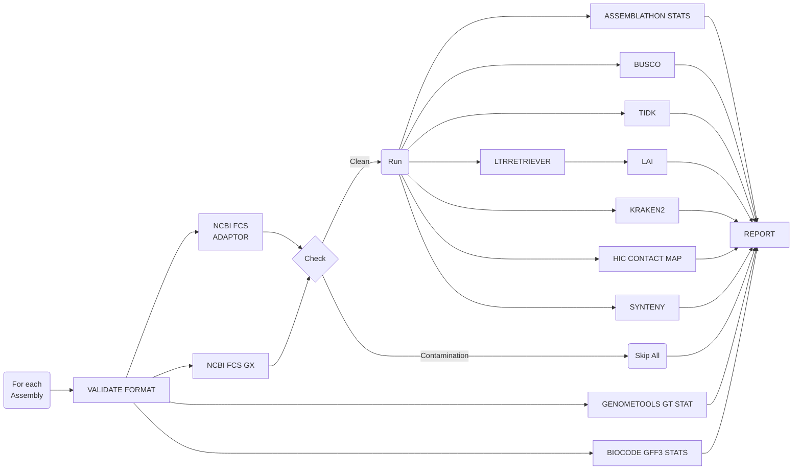

# AssemblyQC

- [AssemblyQC](#assemblyqc)
  - [Introduction](#introduction)
  - [Pipeline Flowchart](#pipeline-flowchart)
  - [Running the Pipeline](#running-the-pipeline)
    - [Quick Start for Plant \& Food Research Users](#quick-start-for-plant--food-research-users)
    - [Post-run clean-up](#post-run-clean-up)
  - [AssemblyQC Report](#assemblyqc-report)
  - [Known Issues](#known-issues)
  - [Software Versions \& References](#software-versions--references)
  - [Contributors](#contributors)

## Introduction

AssemblyQC is a [NextFlow](https://www.nextflow.io/docs/latest/index.html) pipeline which evaluates assembly quality with well-established tools and presents the results in a unified html report. The tools are shown in the [Pipeline Flowchart](#pipeline-flowchart) and their version are listed under [Software Versions & References](#software-versions--references).

## Pipeline Flowchart



- [FASTA VALIDATION](https://github.com/GallVp/fasta_validator)
- [GFF3 VALIDATION](https://github.com/genometools/genometools)
- [ASSEMBLATHON STATS](https://github.com/PlantandFoodResearch/assemblathon2-analysis/blob/a93cba25d847434f7eadc04e63b58c567c46a56d/assemblathon_stats.pl): Assembly statistics
- [GENOMETOOLS GT STAT](https://github.com/genometools/genometools)/[BIOCODE GFF3 STATS](https://github.com/jorvis/biocode): Annotation statistics
- [NCBI FCS ADAPTOR](https://github.com/ncbi/fcs): Adaptor contamination pass/fail
- [NCBI FCS GX](https://github.com/ncbi/fcs): Foreign organism contamination pass/fail
- [BUSCO](https://gitlab.com/ezlab/busco/-/tree/master): Gene-space completeness estimation
- [TIDK](https://github.com/tolkit/telomeric-identifier): Telomere repeat identification
- [LAI](https://github.com/oushujun/LTR_retriever/blob/master/LAI): Continuity of repetitive sequences
- [LAI::LTRRETRIEVER](https://github.com/oushujun/LTR_retriever): Repeat identification
- [KRAKEN2](https://github.com/DerrickWood/kraken2): Taxonomy classification
- [HIC CONTACT MAP](https://github.com/igvteam/juicebox-web): Alignment and visualisation of HiC data
- SYNTENY: Synteny analysis using [MUMMER](https://github.com/mummer4/mummer) and [CIRCOS](http://circos.ca/documentation/)

## Running the Pipeline

See the [tutorials](./docs/README.md) for detailed instructions on how to use the pipeline. The pipeline can be executed on a range of executors including AWS, LSF, Slurm, and others supported by [NextFlow](https://www.nextflow.io/docs/latest/executor.html#executors).

### Quick Start for Plant & Food Research Users

To run the pipeline, first edit the nextflow.config. The following parameters must be checked and modified accordingly:

- target_assemblies
- assembly_gff3
- assemblathon_stats::n_limit
- ncbi_fcs_adaptor::empire
- ncbi_fcs_gx::tax_id
- busco::lineage_datasets
- busco::mode
- tidk::repeat_seq
- hic::paired_reads
- synteny::assembly_seq_list
- synteny::xref_assemblies

Then, the pipeline should be posted to Slurm for execution with the following command:

```bash
sbatch ./assembly_qc_pfr.sh
```

### Post-run clean-up

The intermediary files produced by the pipeline are stored in the "work" folder. After running the pipeline, if you wish to clean up the logs and "work" folder, run the following command:

```bash
./cleanNXF.sh
```

## AssemblyQC Report

Once the pipeline has finished execution, the results folder specified in the config file should contain a file named 'report.html'. The 'report.html' is a standalone file for all the modules except HiC and Kraken2. Thus, if you move the report to another folder, make sure to also move the 'hic' folder and the 'kraken2' folder with it.

## Known Issues

- On its first run, the pipeline has to download a lot many software containers. This download may fail. If it happens, resume the pipeline and it should be able to download the required containers.
- The pipeline may fail more frequently at building singularity containers when the temporary directory is not the system "/tmp" directory.

## Software Versions & References

- nf-core/modules([MIT](https://github.com/nf-core/modules/blob/master/LICENSE))
  > Ewels PA, Peltzer A, Fillinger S et al. 2020. The nf-core framework for community-curated bioinformatics pipelines. Nat Biotechnol 38, 276–278 (2020). doi: <https://doi.org/10.1038/s41587-020-0439-x>

- FASTA_VALIDATE ([MIT](https://github.com/GallVp/fasta_validator/blob/master/LICENSE))
  > <https://github.com/GallVp/fasta_validator>
  >
  > Forked from: <https://github.com/linsalrob/fasta_validator>
  >
  > Edwards RA. 2019. fasta_validate: a fast and efficient fasta validator written in pure C. doi: <https://doi.org/10.5281/zenodo.2532044>
- GT_GFF3VALIDATOR ([ISC](http://genometools.org/license.html))
  > Gremme G, Steinbiss S, Kurtz S. 2013. "GenomeTools: A Comprehensive Software Library for Efficient Processing of Structured Genome Annotations," in IEEE/ACM Transactions on Computational Biology and Bioinformatics, vol. 10, no. 3, pp. 645-656, May 2013, doi: <https://doi.org/10.1109/TCBB.2013.68>.
  
  GT_GFF3VALIDATOR workflow also employs:
  - SAMTOOLS (1.16.1, [MIT/Expat](https://github.com/samtools/samtools/blob/develop/LICENSE))
    > Danecek P, Bonfield JK, Liddle J, Marshall J, Ohan V, Pollard MO, Whitwham A, Keane T, McCarthy SA, Davies RM, Li H. 2021. Twelve years of SAMtools and BCFtools, GigaScience, Volume 10, Issue 2, February 2021, giab008, <https://doi.org/10.1093/gigascience/giab008>
- NCBI-FCS-ADAPTOR (0.4, [License](https://github.com/ncbi/fcs/blob/main/LICENSE.txt))
  > <https://github.com/ncbi/fcs>
- NCBI-FCS-GX (0.4, [License](https://github.com/ncbi/fcs/blob/main/LICENSE.txt))
  > <https://github.com/ncbi/fcs>
  >
  > Astashyn A, Tvedte ES, Sweeney D, Sapojnikov V, Bouk N, Joukov V, Mozes E, Strope PK, Sylla PM, Wagner L, Bidwell SL, Clark K, Davis EW, Smith-White B, Hlavina W, Pruitt KD, Schneider VA, Murphy TD. 2023. bioRxiv 2023.06.02.543519; doi: <https://doi.org/10.1101/2023.06.02.543519>
  
  NCBI-FCS-GX workflow also employs:
  - KRONA (2.7.1, [License](https://github.com/marbl/Krona/blob/master/KronaTools/LICENSE.txt))
    > Ondov BD, Bergman NH, Phillippy AM. 2011. Interactive metagenomic visualization in a Web browser. BMC Bioinformatics. 2011 Sep 30;12:385. doi: <https://doi.org/10.1186/1471-2105-12-385>
- ASSEMBLATHON_STATS ([CC BY-NC-SA 3.0](https://creativecommons.org/licenses/by-nc-sa/3.0/))
  > [github/PlantandFoodResearch/assemblathon2-analysis/a93cba2](https://github.com/PlantandFoodResearch/assemblathon2-analysis/blob/a93cba25d847434f7eadc04e63b58c567c46a56d/assemblathon_stats.pl)
  >
  > Forked from: <https://github.com/ucdavis-bioinformatics/assemblathon2-analysis>
- GENOMETOOLS_GT_STAT (1.6.2, [ISC](http://genometools.org/license.html)):
  > Gremme G, Steinbiss S, Kurtz S. 2013. "GenomeTools: A Comprehensive Software Library for Efficient Processing of Structured Genome Annotations," in IEEE/ACM Transactions on Computational Biology and Bioinformatics, vol. 10, no. 3, pp. 645-656, May 2013, doi: <https://doi.org/10.1109/TCBB.2013.68>.
- BIOCODE_GFF3_STATS (0.10.0, [MIT](https://github.com/jorvis/biocode/blob/master/LICENSE))
  > <https://github.com/jorvis/biocode>
- BUSCO (5.2.2, [MIT](https://gitlab.com/ezlab/busco/-/blob/master/LICENSE))
  > Manni M, Berkeley MR, Seppey M, Simão FA, Zdobnov EM. 2021. BUSCO Update: Novel and Streamlined Workflows along with Broader and Deeper Phylogenetic Coverage for Scoring of Eukaryotic, Prokaryotic, and Viral Genomes, Molecular Biology and Evolution, Volume 38, Issue 10, October 2021, Pages 4647–4654, <https://doi.org/10.1093/molbev/msab199>
- TIDK (0.2.31, [MIT](https://github.com/tolkit/telomeric-identifier/blob/main/LICENSE))
  > <https://github.com/tolkit/telomeric-identifier>
  
  TIDK workflow also employs:
  - SEQKIT (2.3.1, [MIT](https://github.com/shenwei356/seqkit/blob/master/LICENSE))
    > Shen W, Le S, Li Y, Hu F. 2016. SeqKit: A Cross-Platform and Ultrafast Toolkit for FASTA/Q File Manipulation. PLoS ONE 11(10): e0163962. <https://doi.org/10.1371/journal.pone.0163962>
- LAI (beta3.2, [GPL v3](https://github.com/oushujun/LTR_retriever/blob/master/LICENSE))
  > Ou S, Chen J, Jiang N. 2018. Assessing genome assembly quality using the LTR Assembly Index (LAI), Nucleic Acids Research, Volume 46, Issue 21, 30 November 2018, Page e126, <https://doi.org/10.1093/nar/gky730>
  
  LAI workflow also employs:
  - LTR_FINDER_parallel (1.2, [MIT](https://github.com/oushujun/LTR_FINDER_parallel/blob/master/LICENSE))
    > Ou S, Jiang N 2019. LTR_FINDER_parallel: parallelization of LTR_FINDER enabling rapid identification of long terminal repeat retrotransposons. Mobile DNA 10, 48 (2019). <https://doi.org/10.1186/s13100-019-0193-0>
  - GT_LTRHARVEST (1.6.5, [ISC](http://genometools.org/license.html))
    > Gremme G, Steinbiss S, Kurtz S. 2013. "GenomeTools: A Comprehensive Software Library for Efficient Processing of Structured Genome Annotations," in IEEE/ACM Transactions on Computational Biology and Bioinformatics, vol. 10, no. 3, pp. 645-656, May 2013, doi: <https://doi.org/10.1109/TCBB.2013.68>.
    
    > Ellinghaus, D, Kurtz, S & Willhoeft, U 2008. LTRharvest, an efficient and flexible software for de novo detection of LTR retrotransposons. BMC Bioinformatics 9, 18 (2008). <https://doi.org/10.1186/1471-2105-9-18>
  - LTR_retriever (2.9.0 [GPL v3](https://github.com/oushujun/LTR_retriever/blob/master/LICENSE))
    > Shujun O, Ning J 2018. LTR_retriever: A Highly Accurate and Sensitive Program for Identification of Long Terminal Repeat Retrotransposons, Plant Physiology, 176, 2 (2018). <https://doi.org/10.1104/pp.17.01310>
- KRAKEN2 (2.1.2, [MIT](https://github.com/DerrickWood/kraken2/blob/master/LICENSE))
  > Wood DE, Salzberg SL, Wood DE, Lu J, Langmead B. 2019.  Improved metagenomic analysis with Kraken 2. Genome Biol 20, 257 (2019). <https://doi.org/10.1186/s13059-019-1891-0>
  
  KRAKEN2 workflow also employs:
  - KRONA (2.7.1, [License](https://github.com/marbl/Krona/blob/master/KronaTools/LICENSE.txt))
    > Ondov BD, Bergman NH, Phillippy AM. 2011. Interactive metagenomic visualization in a Web browser. BMC Bioinformatics. 2011 Sep 30;12:385. doi: <https://doi.org/10.1186/1471-2105-12-385>
- HIC CONTACT MAP
  - JUICEBOX.JS (2.4.3, [MIT](https://github.com/igvteam/juicebox.js/blob/master/LICENSE))
    > Robinson JT, Turner D, Durand NC, Thorvaldsdóttir H, Mesirov JP, Aiden EL. 2018. Juicebox.js Provides a Cloud-Based Visualization System for Hi-C Data. Cell Syst. 2018 Feb 28;6(2):256-258.e1. doi: <https://doi.org/10.1016/j.cels.2018.01.001>. Epub 2018 Feb 7. PMID: 29428417; PMCID: PMC6047755.
  - FASTP (0.23.2, [MIT](https://github.com/OpenGene/fastp/blob/master/LICENSE))
    > Chen S, Zhou Y, Chen Y, Gu J. 2018. fastp: an ultra-fast all-in-one FASTQ preprocessor, Bioinformatics, Volume 34, Issue 17, 01 September 2018, Pages i884–i890, <https://doi.org/10.1093/bioinformatics/bty560>
  - FASTQC (0.11.9, [GPL v3](https://github.com/s-andrews/FastQC/blob/master/LICENSE.txt))
    > <https://github.com/s-andrews/FastQC>
  - RUN_ASSEMBLY_VISUALIZER (commit: 63029aa, [MIT](https://github.com/aidenlab/3d-dna/blob/master/LICENSE))
    > Dudchenko O, Batra SS, Omer AD, Nyquist SK, Hoeger M, Durand NC, Shamim MS, Machol I, Lander, Aiden AP, Aiden EL  2017. De novo assembly of the Aedes aegypti genome using Hi-C yields chromosome-length scaffolds.Science356, 92-95(2017). doi: <https://doi.org/10.1126/science.aal3327>. Available at: <https://github.com/aidenlab/3d-dna/commit/63029aa3bc5ba9bbdad9dd9771ace583cc95e273>
  - HIC_QC (commit: 6881c33, [AGPL v3](https://github.com/phasegenomics/hic_qc/blob/master/LICENSE))
    > <https://github.com/phasegenomics/hic_qc/commit/6881c3390fd4afb85009a52918b4d068100c58b4>
  - JUICEBOX_SCRIPTS (commit: a7ae991, [AGPL v3](https://github.com/phasegenomics/juicebox_scripts/blob/master/LICENSE))
    > <https://github.com/phasegenomics/juicebox_scripts/commit/a7ae9915401eb677b8058b0118011ce440999bc0>
  - BWA (0.7.17, [GPL v3](https://github.com/lh3/bwa/blob/master/COPYING))
    > Li H. 2013. Aligning sequence reads, clone sequences and assembly contigs with BWA-MEM. <https://doi.org/10.48550/arXiv.1303.3997>
  - MATLOCK ([AGPL v3](https://github.com/phasegenomics/matlock/blob/master/LICENSE))
    > <https://github.com/phasegenomics/matlock>; <https://quay.io/biocontainers/matlock:20181227--h4b03ef3_3>
  - SAMBLASTER (0.1.20, [MIT](https://github.com/GregoryFaust/samblaster/blob/master/LICENSE.txt))
    > Faust GG, Hall IM. 2014. SAMBLASTER: fast duplicate marking and structural variant read extraction, Bioinformatics, Volume 30, Issue 17, September 2014, Pages 2503–2505, <https://doi.org/10.1093/bioinformatics/btu314>
  - SAMTOOLS (1.16.1, [MIT/Expat](https://github.com/samtools/samtools/blob/develop/LICENSE))
    > Danecek P, Bonfield JK, Liddle J, Marshall J, Ohan V, Pollard MO, Whitwham A, Keane T, McCarthy SA, Davies RM, Li H. 2021. Twelve years of SAMtools and BCFtools, GigaScience, Volume 10, Issue 2, February 2021, giab008, <https://doi.org/10.1093/gigascience/giab008>
- SYNTENY
  - CIRCOS (0.23-1, [GPL v3](https://www.gnu.org/licenses/gpl-3.0.txt))
    > Krzywinski M, Schein J, Birol I, Connors J, Gascoyne R. Horsman D, ... Marra MA. 2009. Circos: an information aesthetic for comparative genomics. Genome research, 19(9), 1639-1645. <https://doi.org/10.1101/gr.092759.109>
  - MUMMER (4.0.0, [Artistic 2.0](https://github.com/mummer4/mummer/blob/master/LICENSE.md))
    > Marçais G, Delcher AL, Phillippy AM, Coston R, Salzberg SL, Zimin A. 2018. MUMmer4: A fast and versatile genome alignment system. PLoS Comput Biol. 2018 Jan 26;14(1):e1005944. doi: <https://doi.org/10.1371/journal.pcbi.1005944>. PMID: 29373581; PMCID: PMC5802927.
  - SAMTOOLS (1.16.1, [MIT/Expat](https://github.com/samtools/samtools/blob/develop/LICENSE))
    > Danecek P, Bonfield JK, Liddle J, Marshall J, Ohan V, Pollard MO, Whitwham A, Keane T, McCarthy SA, M Davies RM, Li H. 2021. Twelve years of SAMtools and BCFtools, GigaScience, Volume 10, Issue 2, February 2021, giab008, <https://doi.org/10.1093/gigascience/giab008>

## Contributors

Cecilia Deng [@CeciliaDeng](https://github.com/CeciliaDeng), Chen Wu [@christinawu2008](https://github.com/christinawu2008), Jason Shiller [@jasonshiller](https://github.com/jasonshiller), Ken Smith [@hzlnutspread](https://github.com/hzlnutspread), Marcus Davy [@mdavy86](https://github.com/mdavy86), Ross Crowhurst [@rosscrowhurst](https://github.com/rosscrowhurst), Susan Thomson [@cflsjt](https://github.com/cflsjt), Ting-Hsuan Chen [@ting-hsuan-chen](https://github.com/ting-hsuan-chen), Usman Rashid [@GallVp](https://github.com/GallVp)
