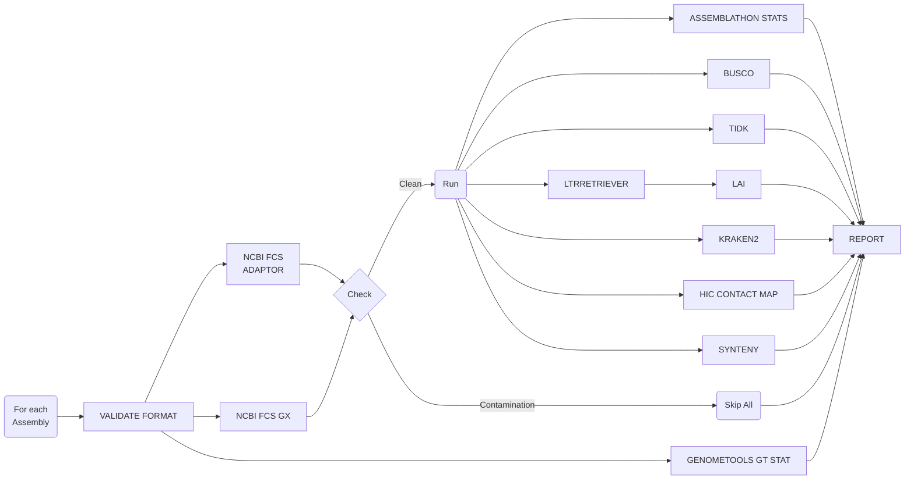

[](https://github.com/plant-food-research-open/assemblyqc/actions/workflows/ci.yml)
[](https://github.com/plant-food-research-open/assemblyqc/actions/workflows/linting.yml)[](https://doi.org/10.5281/zenodo.10647870)
[](https://www.nf-test.com)

[](https://www.nextflow.io/)
[](https://docs.conda.io/en/latest/)
[](https://www.docker.com/)
[](https://sylabs.io/docs/)
[](https://tower.nf/launch?pipeline=https://github.com/plant-food-research-open/assemblyqc)

## Introduction

**plant-food-research-open/assemblyqc** is a [NextFlow](https://www.nextflow.io/docs/latest/index.html) pipeline which evaluates assembly quality with multiple QC tools and presents the results in a unified html report. The tools are shown in the [Pipeline Flowchart](#pipeline-flowchart) and their version are listed in [CITATIONS.md](./CITATIONS.md).

## Pipeline Flowchart



- [FASTA VALIDATION](https://github.com/GallVp/fasta_validator)
- [GFF3 VALIDATION](https://github.com/genometools/genometools)
- [ASSEMBLATHON STATS](https://github.com/PlantandFoodResearch/assemblathon2-analysis/blob/a93cba25d847434f7eadc04e63b58c567c46a56d/assemblathon_stats.pl): Assembly statistics
- [GENOMETOOLS GT STAT](https://github.com/genometools/genometools): Annotation statistics
- [NCBI FCS ADAPTOR](https://github.com/ncbi/fcs): Adaptor contamination pass/fail
- [NCBI FCS GX](https://github.com/ncbi/fcs): Foreign organism contamination pass/fail
- [BUSCO](https://gitlab.com/ezlab/busco/-/tree/master): Gene-space completeness estimation
- [TIDK](https://github.com/tolkit/telomeric-identifier): Telomere repeat identification
- [LAI](https://github.com/oushujun/LTR_retriever/blob/master/LAI): Continuity of repetitive sequences
- [KRAKEN2](https://github.com/DerrickWood/kraken2): Taxonomy classification
- [HIC CONTACT MAP](https://github.com/igvteam/juicebox-web): Alignment and visualisation of HiC data
- SYNTENY: Synteny analysis using [MUMMER](https://github.com/mummer4/mummer) and [CIRCOS](http://circos.ca/documentation/)

## Usage

Refer to [usage](./docs/usage.md), [parameters](./docs/parameters.md) and [output](./docs/output.md) documents for details.

> [!NOTE]
> If you are new to Nextflow and nf-core, please refer to [this page](https://nf-co.re/docs/usage/installation) on how to set-up Nextflow. Make sure to [test your setup](https://nf-co.re/docs/usage/introduction#how-to-run-a-pipeline) with `-profile test` before running the workflow on actual data.

Prepare an `assemblysheet.csv` file with following columns representing target assemblies and associated meta-data. See an example [assemblysheet.csv](./assets/assemblysheet.csv)

- `tag:` A unique tag which represents the target assembly throughout the pipeline and in the final report
- `fasta:` FASTA file
- `gff3 [Optional]:` GFF3 annotation file if available
- `monoploid_ids [Optional]:` A txt file listing the IDs used to calculate LAI in monoploid mode if necessary
- `synteny_labels [Optional]:` A two column tsv file listing fasta sequence ids (first column) and labels for the synteny plots (second column) when performing synteny analysis

Now, you can run the pipeline using:

```bash
nextflow run plant-food-research-open/assemblyqc \
   -profile <docker/singularity/.../institute> \
   --input assemblysheet.csv \
   --outdir <OUTDIR>
```

> [!WARNING]
> Please provide pipeline parameters via the CLI or Nextflow `-params-file` option. Custom config files including those provided by the `-c` Nextflow option can be used to provide any configuration _**except for parameters**_;
> see [docs](https://nf-co.re/usage/configuration#custom-configuration-files).

### Quick Start for Plant&Food Users

Download the pipeline to your `/workspace/$USER` folder. Change the parameters defined in the [pfr/params.json](./pfr/params.json) file. Submit the pipeline to SLURM for execution.

```bash
sbatch ./pfr_assemblyqc
```

## Credits

plant-food-research-open/assemblyqc was originally written by Usman Rashid and Ken Smith. Ross Crowhurst, Chen Wu and Marcus Davy generously contributed their QC scripts.

We thank the following people for their extensive assistance in the development of this pipeline:

- Cecilia Deng [@CeciliaDeng](https://github.com/CeciliaDeng)
- Chen Wu [@christinawu2008](https://github.com/christinawu2008)
- Jason Shiller [@jasonshiller](https://github.com/jasonshiller)
- Marcus Davy [@mdavy86](https://github.com/mdavy86)
- Ross Crowhurst [@rosscrowhurst](https://github.com/rosscrowhurst)
- Susan Thomson [@cflsjt](https://github.com/cflsjt)
- Ting-Hsuan Chen [@ting-hsuan-chen](https://github.com/ting-hsuan-chen)

## Contributions and Support

If you would like to contribute to this pipeline, please see the [contributing guidelines](.github/CONTRIBUTING.md).

## Citations

If you use plant-food-research-open/assemblyqc for your analysis, please cite it using the following doi: [10.5281/zenodo.10647870](https://doi.org/10.5281/zenodo.10647870)

An extensive list of references for the tools used by the pipeline can be found in the [`CITATIONS.md`](CITATIONS.md) file.

This pipeline uses code and infrastructure developed and maintained by the [nf-core](https://nf-co.re) community, reused here under the [MIT license](https://github.com/nf-core/tools/blob/master/LICENSE).

> **The nf-core framework for community-curated bioinformatics pipelines.**
>
> Philip Ewels, Alexander Peltzer, Sven Fillinger, Harshil Patel, Johannes Alneberg, Andreas Wilm, Maxime Ulysse Garcia, Paolo Di Tommaso & Sven Nahnsen.
>
> _Nat Biotechnol._ 2020 Feb 13. doi: [10.1038/s41587-020-0439-x](https://dx.doi.org/10.1038/s41587-020-0439-x).
