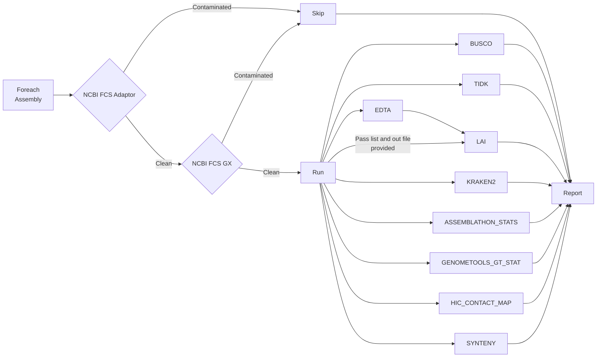

# AssemblyQC

## Table of Contents

- [AssemblyQC](#assemblyqc)
  - [Table of Contents](#table-of-contents)
  - [Introduction](#introduction)
  - [Contributors](#contributors)
  - [Pipeline Flowchart](#pipeline-flowchart)
  - [Installation](#installation)
  - [Running the Pipeline](#running-the-pipeline)
    - [Post the NextFlow Process to Slurm](#post-the-nextflow-process-to-slurm)
    - [Run Interactively](#run-interactively)
    - [Post-run clean-up](#post-run-clean-up)
  - [Getting sample data](#getting-sample-data)
  - [Known Issues](#known-issues)
  - [Software Versions \& References](#software-versions--references)
  - [Future Tools](#future-tools)

## Introduction

Welcome to AssemblyQC. This Nextflow pipeline evaluates assembly quality with well established tools and presents the results in a unified html report. The tools are shown in the [Pipeline Flowchart](#pipeline-flowchart) and their version are listed under [Software Versions & References](#software-versions--references).

## Contributors

- Cecilia Deng [@CeciliaDeng](https://github.com/CeciliaDeng), Chen Wu [@christinawu2008](https://github.com/christinawu2008), Jason Shiller [@jasonshiller](https://github.com/jasonshiller), Ken Smith [@hzlnutspread](https://github.com/hzlnutspread), Marcus Davy [@mdavy86](https://github.com/mdavy86), Ross Crowhurst [@rosscrowhurst](https://github.com/rosscrowhurst), Susan Thomson [@cflsjt](https://github.com/cflsjt), Usman Rashid [@GallVp](https://github.com/GallVp)

## Pipeline Flowchart



## Installation

1. Copy the Github repository URL and run the following in your target folder:

```bash
git clone https://github.com/PlantandFoodResearch/assembly_qc.git
```

2. Navigate into the project

```bash
cd assembly_qc/
```

## Running the Pipeline

To run the pipeline on a new assembly, edit the nextflow.config. The following parameters must be checked and modified accordingly:

- target_assemblies
- assembly_gff3
- assamblathon_stats::n_limit
- ncbi_fcs_adaptor::empire
- ncbi_fcs_gx::tax_id
- busco::lineage_datasets
- tidk::repeat_seq
- hic::reads_folder
- hic::paired_reads
- synteny::assembly_seq_list
- synteny::xref_assemblies

### Post the NextFlow Process to Slurm

```bash
cat << EOF > assembly_qc_slurm.sh
#!/bin/bash -e


#SBATCH --job-name asm_qc_${USER}
#SBATCH --time=14-00:00:00
#SBATCH --nodes=1
#SBATCH --ntasks=1
#SBATCH --cpus-per-task=1
#SBATCH --output asm_qc_${USER}.stdout
#SBATCH --error asm_qc_${USER}.stderr
#SBATCH --mem=1G

ml unload perl
ml apptainer/1.1
ml conda/22.9.0
ml nextflow/22.10.4

export NXF_CONDA_CACHEDIR=$(realpath ~/.conda)

srun nextflow main.nf -profile slurm -resume
EOF

chmod u+x ./assembly_qc_slurm.sh

sbatch ./assembly_qc_slurm.sh
```

You will now see a results folder which will contain a file named 'report.html' and can be viewed on the [powerPlant storage server](https://storage.powerplant.pfr.co.nz).

### Run Interactively

- Load the required modules:

```bash
ml unload perl
ml apptainer/1.1
ml conda/22.9.0
ml nextflow/22.10.4
```

- Set Conda cache directory:

```bash
export NXF_CONDA_CACHEDIR=$(realpath ~/.conda)
```

- Run the pipeline:

```bash
nextflow main.nf -profile slurm -resume
```

### Post-run clean-up

After running the pipeline, if you wish to clean up the logs and work folder, you can run the following:

```bash
./cleanNXF.sh
```

The work folder contains intermediary files produced by the pipeline tools.

## Getting sample data

In order to retrieve dummy data to test the pipeline with, run the following:

```bash
ml seqkit/0.7.0
mkdir test_data
cp /output/genomic/fairGenomes/Fungus/Neonectria/ditissima/sex_na/1x/assembly_rs324p/v1/Nd324_canupilon_all.sorted.renamed.fasta \
./test_data/test_data_original.fasta
seqkit sample -p 0.8 -s 33 ./test_data/test_data_original.fasta > ./test_data/test_data1.fasta
seqkit sample -p 0.8 -s 49 ./test_data/test_data_original.fasta > ./test_data/test_data2.fasta
seqkit sample -p 0.5 -s 22 ./test_data/test_data_original.fasta > ./test_data/test_data3.fasta
seqkit sample -p 0.5 -s 33 ./test_data/test_data_original.fasta > ./test_data/test_data4.fasta
rm ./test_data/test_data_original.fasta
cp /output/genomic/fairGenomes/Fungus/Neonectria/ditissima/sex_na/1x/assembly_rs324p/v1/augustus.hints.fixed.gff3 ./test_data/test_data1.gff3
cp /output/genomic/fairGenomes/Fungus/Neonectria/ditissima/sex_na/1x/assembly_rs324p/v1/augustus.hints.fixed.gff3 ./test_data/test_data2.gff3
cat ./test_data/test_data1.fasta | grep ">*chr" | head -3 | sed 's/>//g' | awk '{print $1, "h1_"NR}' OFS="\t" > ./test_data/test_data1.seq.list
cat ./test_data/test_data2.fasta | grep ">*chr" | tail -2 | sed 's/>//g' | awk '{print $1, "h2_"NR}' OFS="\t" >  ./test_data/test_data2.seq.list
cat ./test_data/test_data3.fasta | grep ">*chr" | head -5 | tail -2 | sed 's/>//g' | awk '{print $1, "GA_"NR}' OFS="\t" >  ./test_data/test_data3.seq.list
cat ./test_data/test_data4.fasta | grep ">*chr" | tail -3 | sed 's/>//g' | awk '{print $1, "GB_"NR}' OFS="\t" >  ./test_data/test_data4.seq.list
```

The test data will take around 15 minutes to run.

## Known Issues

- On its first run, the pipeline has to download a lot many software containers. This download may fail. If it happens, resume the pipeline again and it should be able to download the required containers.

## Software Versions & References

- NCBI-FCS-ADAPTOR (0.4)
  > <https://github.com/ncbi/fcs>
- NCBI-FCS-GX (0.4)
  > <https://github.com/ncbi/fcs>
- ASSEMBLATHON_STATS
  > [github/PlantandFoodResearch/assemblathon2-analysis/a93cba2](https://github.com/PlantandFoodResearch/assemblathon2-analysis/blob/a93cba25d847434f7eadc04e63b58c567c46a56d/assemblathon_stats.pl)
- GENOMETOOLS_GT_STAT (1.6.2):
  > G. Gremme, S. Steinbiss and S. Kurtz, "GenomeTools: A Comprehensive Software Library for Efficient Processing of Structured Genome Annotations," in IEEE/ACM Transactions on Computational Biology and Bioinformatics, vol. 10, no. 3, pp. 645-656, May 2013, doi: <https://doi.org/10.1109/TCBB.2013.68>.
- BUSCO (5.2.2)
  > Mosè Manni, Matthew R Berkeley, Mathieu Seppey, Felipe A Simão, Evgeny M Zdobnov, BUSCO Update: Novel and Streamlined Workflows along with Broader and Deeper Phylogenetic Coverage for Scoring of Eukaryotic, Prokaryotic, and Viral Genomes, Molecular Biology and Evolution, Volume 38, Issue 10, October 2021, Pages 4647–4654, <https://doi.org/10.1093/molbev/msab199>
- TIDK (0.2.31)
  > <https://github.com/tolkit/telomeric-identifier>
  
  TIDK workflow also employs:
  - SEQKIT (2.3.1)
    > Shen W, Le S, Li Y, Hu F (2016) SeqKit: A Cross-Platform and Ultrafast Toolkit for FASTA/Q File Manipulation. PLoS ONE 11(10): e0163962. <https://doi.org/10.1371/journal.pone.0163962>
- LAI (2.9.0)
  > Shujun Ou, Jinfeng Chen, Ning Jiang, Assessing genome assembly quality using the LTR Assembly Index (LAI), Nucleic Acids Research, Volume 46, Issue 21, 30 November 2018, Page e126, <https://doi.org/10.1093/nar/gky730>
  
  LAI workflow also employs:
  - EDTA (2.1.0)
    > Ou, S., Su, W., Liao, Y. et al. Benchmarking transposable element annotation methods for creation of a streamlined, comprehensive pipeline. Genome Biol 20, 275 (2019). <https://doi.org/10.1186/s13059-019-1905-y>
- KRAKEN2 (2.1.2)
  > Wood, D. E., & Salzberg, S. L. (2014). Wood, D.E., Lu, J. & Langmead, B. Improved metagenomic analysis with Kraken 2. Genome Biol 20, 257 (2019). <https://doi.org/10.1186/s13059-019-1891-0>
  
  KRAKEN2 workflow also employs:
  - KRONA (2.7.1)
    > Ondov BD, Bergman NH, Phillippy AM. Interactive metagenomic visualization in a Web browser. BMC Bioinformatics. 2011 Sep 30;12:385. doi: <https://doi.org/10.1186/1471-2105-12-385>
- HIC CONTACT MAP
  - JUICEBOX.JS (2.4.3)
    > Robinson JT, Turner D, Durand NC, Thorvaldsdóttir H, Mesirov JP, Aiden EL. Juicebox.js Provides a Cloud-Based Visualization System for Hi-C Data. Cell Syst. 2018 Feb 28;6(2):256-258.e1. doi: <https://doi.org/10.1016/j.cels.2018.01.001>. Epub 2018 Feb 7. PMID: 29428417; PMCID: PMC6047755.
  - FASTP (0.23.2)
    > Shifu Chen, Yanqing Zhou, Yaru Chen, Jia Gu, fastp: an ultra-fast all-in-one FASTQ preprocessor, Bioinformatics, Volume 34, Issue 17, 01 September 2018, Pages i884–i890, <https://doi.org/10.1093/bioinformatics/bty560>
  - FASTQC (0.11.9)
    > <https://github.com/s-andrews/FastQC>
  - RUN_ASSEMBLY_VISUALIZER (commit: 63029aa)
    > Olga Dudchenko et al. ,De novo assembly of the Aedes aegypti genome using Hi-C yields chromosome-length scaffolds.Science356, 92-95(2017). doi: <https://doi.org/10.1126/science.aal3327>. Available at: <https://github.com/aidenlab/3d-dna/commit/63029aa3bc5ba9bbdad9dd9771ace583cc95e273>
  - HIC_QC (commit: 6881c33)
    > <https://github.com/phasegenomics/hic_qc/commit/6881c3390fd4afb85009a52918b4d068100c58b4>
  - JUICEBOX_SCRIPTS (commit: a7ae991)
    > <https://github.com/phasegenomics/juicebox_scripts/commit/a7ae9915401eb677b8058b0118011ce440999bc0>
  - BWA (0.7.17)
    > Li, H. (2013). Aligning sequence reads, clone sequences and assembly contigs with BWA-MEM. <https://doi.org/10.48550/arXiv.1303.3997>
  - MATLOCK
    > <https://github.com/phasegenomics/matlock>; <https://quay.io/biocontainers/matlock:20181227--h4b03ef3_3>
  - SAMBLASTER (0.1.20)
    > Gregory G. Faust, Ira M. Hall, SAMBLASTER: fast duplicate marking and structural variant read extraction, Bioinformatics, Volume 30, Issue 17, September 2014, Pages 2503–2505, <https://doi.org/10.1093/bioinformatics/btu314>
  - SAMTOOLS (1.16.1)
    > Petr Danecek, James K Bonfield, Jennifer Liddle, John Marshall, Valeriu Ohan, Martin O Pollard, Andrew Whitwham, Thomas Keane, Shane A McCarthy, Robert M Davies, Heng Li, Twelve years of SAMtools and BCFtools, GigaScience, Volume 10, Issue 2, February 2021, giab008, <https://doi.org/10.1093/gigascience/giab008>
- SYNTENY
  - CIRCOS (0.23-1)
    > Krzywinski, M., Schein, J., Birol, I., Connors, J., Gascoyne, R., Horsman, D., ... & Marra, M. A. (2009). Circos: an information aesthetic for comparative genomics. Genome research, 19(9), 1639-1645. <https://doi.org/10.1101/gr.092759.109>
  - MUMMER (4.0.0)
    > Marçais G, Delcher AL, Phillippy AM, Coston R, Salzberg SL, Zimin A. MUMmer4: A fast and versatile genome alignment system. PLoS Comput Biol. 2018 Jan 26;14(1):e1005944. doi: <https://doi.org/10.1371/journal.pcbi.1005944>. PMID: 29373581; PMCID: PMC5802927.
  - SAMTOOLS (1.16.1)
    > Petr Danecek, James K Bonfield, Jennifer Liddle, John Marshall, Valeriu Ohan, Martin O Pollard, Andrew Whitwham, Thomas Keane, Shane A McCarthy, Robert M Davies, Heng Li, Twelve years of SAMtools and BCFtools, GigaScience, Volume 10, Issue 2, February 2021, giab008, <https://doi.org/10.1093/gigascience/giab008>

## Future Tools

- [ ] SubPhaser: [https://github.com/zhangrengang/SubPhaser](https://github.com/zhangrengang/SubPhaser)
- [ ] Merqury: [https://github.com/marbl/merqury](https://github.com/marbl/merqury)
- [ ] findZX: [https://github.com/hsigeman/findZX](https://github.com/hsigeman/findZX)
- [ ] NGenomeSyn: <https://github.com/hewm2008/NGenomeSyn>; Consensus vs Haplotypes
