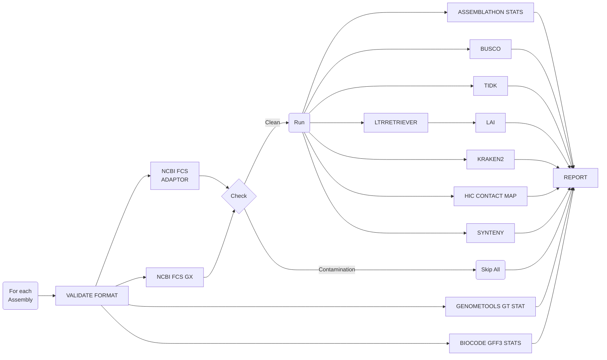

# AssemblyQC

[](https://doi.org/10.5281/zenodo.10647870)

- [AssemblyQC](#assemblyqc)
  - [Introduction](#introduction)
  - [Pipeline Flowchart](#pipeline-flowchart)
  - [Usage](#usage)
    - [Minimal Test Run](#minimal-test-run)
    - [Plant\&Food Users](#plantfood-users)
  - [AssemblyQC Report](#assemblyqc-report)
  - [Contributors](#contributors)
  - [Citations](#citations)

## Introduction

AssemblyQC is a [NextFlow](https://www.nextflow.io/docs/latest/index.html) pipeline which evaluates assembly quality with well-established tools and presents the results in a unified html report. The tools are shown in the [Pipeline Flowchart](#pipeline-flowchart) and their version are listed in [CITATIONS.md](./CITATIONS.md).

## Pipeline Flowchart


```mermaid
flowchart LR
  forEachTag(For each\nAssembly) --> VALIDATE_FORMAT[VALIDATE FORMAT]

  VALIDATE_FORMAT --> ncbiFCS[NCBI FCS\nADAPTOR]
  ncbiFCS --> Check{Check}

  VALIDATE_FORMAT --> ncbiGX[NCBI FCS GX]
  ncbiGX --> Check
  Check --> |Clean|Run(Run)

  Check --> |Contamination|Skip(Skip All)
  Skip --> REPORT

  VALIDATE_FORMAT --> GFF_STATS[GENOMETOOLS GT STAT]
  VALIDATE_FORMAT --> GFF_STATS_II[BIOCODE GFF3 STATS]

  Run --> ASS_STATS[ASSEMBLATHON STATS]
  Run --> BUSCO
  Run --> TIDK
  Run --> LTRRETRIEVER
  LTRRETRIEVER --> LAI
  Run --> KRAKEN2
  Run --> HIC_CONTACT_MAP[HIC CONTACT MAP]
  Run --> SYNTENY

  ASS_STATS --> REPORT
  GFF_STATS --> REPORT
  GFF_STATS_II --> REPORT
  BUSCO --> REPORT
  TIDK --> REPORT
  LAI --> REPORT
  KRAKEN2 --> REPORT
  HIC_CONTACT_MAP --> REPORT
  SYNTENY --> REPORT
```

- [FASTA VALIDATION](https://github.com/GallVp/fasta_validator)
- [GFF3 VALIDATION](https://github.com/genometools/genometools)
- [ASSEMBLATHON STATS](https://github.com/PlantandFoodResearch/assemblathon2-analysis/blob/a93cba25d847434f7eadc04e63b58c567c46a56d/assemblathon_stats.pl): Assembly statistics
- [GENOMETOOLS GT STAT](https://github.com/genometools/genometools)/[BIOCODE GFF3 STATS](https://github.com/jorvis/biocode): Annotation statistics
- [NCBI FCS ADAPTOR](https://github.com/ncbi/fcs): Adaptor contamination pass/fail
- [NCBI FCS GX](https://github.com/ncbi/fcs): Foreign organism contamination pass/fail
- [BUSCO](https://gitlab.com/ezlab/busco/-/tree/master): Gene-space completeness estimation
- [TIDK](https://github.com/tolkit/telomeric-identifier): Telomere repeat identification
- [LAI](https://github.com/oushujun/LTR_retriever/blob/master/LAI): Continuity of repetitive sequences
- [LAI::LTRRETRIEVER](https://github.com/oushujun/LTR_retriever): Repeat identification
- [KRAKEN2](https://github.com/DerrickWood/kraken2): Taxonomy classification
- [HIC CONTACT MAP](https://github.com/igvteam/juicebox-web): Alignment and visualisation of HiC data
- SYNTENY: Synteny analysis using [MUMMER](https://github.com/mummer4/mummer), [CIRCOS](http://circos.ca/documentation/) and [PLOTLY](https://plotly.com/python/)

## Usage

See the [tutorials](./docs/README.md) for detailed instructions on how to use the pipeline. The pipeline can be executed on a range of executors including AWS, LSF, Slurm, and others supported by [NextFlow](https://www.nextflow.io/docs/latest/executor.html#executors).

### Minimal Test Run

```bash
nextflow main.nf \
  -profile local,docker \
  -c conf/test_minimal.config
```

### Plant&Food Users

To run the pipeline, first edit the nextflow.config. The following parameters must be checked and modified accordingly:

- target_assemblies
- assembly_gff3
- assemblathon_stats::n_limit
- ncbi_fcs_adaptor::empire
- ncbi_fcs_gx::tax_id
- busco::lineage_datasets
- busco::mode
- tidk::repeat_seq
- hic::paired_reads
- synteny::assembly_seq_list
- synteny::xref_assemblies

Then, the pipeline should be posted to Slurm for execution with the following command:

```bash
sbatch ./pfr_assemblyqc
```

## AssemblyQC Report

Once the pipeline has finished execution, the results folder specified in the config file should contain a file named 'report.html'. The 'report.html' is a standalone file for all the modules except HiC, Kraken2 and Synteny. Thus, if you move the report to another folder, make sure to also move the 'hic', 'kraken2' and 'synteny' folder with it.

## Contributors

- Cecilia Deng [@CeciliaDeng](https://github.com/CeciliaDeng)
- Chen Wu [@christinawu2008](https://github.com/christinawu2008)
- Jason Shiller [@jasonshiller](https://github.com/jasonshiller)
- Ken Smith [@hzlnutspread](https://github.com/hzlnutspread)
- Marcus Davy [@mdavy86](https://github.com/mdavy86)
- Ross Crowhurst [@rosscrowhurst](https://github.com/rosscrowhurst)
- Susan Thomson [@cflsjt](https://github.com/cflsjt)
- Ting-Hsuan Chen [@ting-hsuan-chen](https://github.com/ting-hsuan-chen)
- Usman Rashid [@GallVp](https://github.com/GallVp)

The pipeline uses nf-core modules contributed by following authors.

<a href="https://github.com/drpatelh"></a>
<a href="https://github.com/erikrikarddaniel"></a>
<a href="https://github.com/friederikehanssen"></a>
<a href="https://github.com/gallvp"></a>
<a href="https://github.com/jeremy1805"></a>
<a href="https://github.com/jfy133"></a>
<a href="https://github.com/joseespinosa"></a>
<a href="https://github.com/lescai"></a>
<a href="https://github.com/matthdsm"></a>
<a href="https://github.com/maxulysse"></a>

## Citations

For a comprehensive list of references and versions for the tools, see [CITATIONS.md](./CITATIONS.md). If you use plant-food-research-open/assemblyqc for your analysis, please cite it as:

> Rashid, U., Wu, C., Shiller, J., Smith, K., Crowhurst, R., Davy, M., Chen, T.-H., Thomson, S., & Deng, C. (2024). AssemblyQC: A NextFlow pipeline for evaluating assembly quality (1.3.2). Zenodo. https://doi.org/10.5281/zenodo.10647870

This pipeline uses code and infrastructure developed and maintained by the [nf-core](https://nf-co.re) community, reused here under the [MIT license](https://github.com/nf-core/tools/blob/master/LICENSE).

> **The nf-core framework for community-curated bioinformatics pipelines.**
>
> Philip Ewels, Alexander Peltzer, Sven Fillinger, Harshil Patel, Johannes Alneberg, Andreas Wilm, Maxime Ulysse Garcia, Paolo Di Tommaso & Sven Nahnsen.
>
> _Nat Biotechnol._ 2020 Feb 13. doi: [10.1038/s41587-020-0439-x](https://dx.doi.org/10.1038/s41587-020-0439-x).
