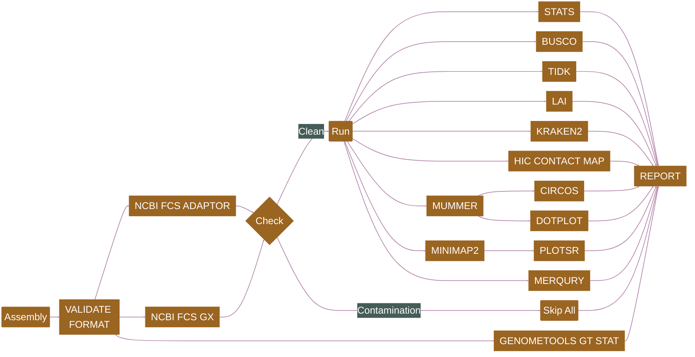

# plant-food-research-open/assemblyqc

[](https://github.com/plant-food-research-open/assemblyqc/actions/workflows/ci.yml)
[](https://github.com/plant-food-research-open/assemblyqc/actions/workflows/linting.yml)[](https://doi.org/10.1093/bioinformatics/btae477)
[](https://www.nf-test.com)

[](https://www.nextflow.io/)
[](https://docs.conda.io/en/latest/)
[](https://www.docker.com/)
[](https://sylabs.io/docs/)
[](https://cloud.seqera.io/launch?pipeline=https://github.com/plant-food-research-open/assemblyqc)

## Introduction

**plant-food-research-open/assemblyqc** is a [Nextflow](https://www.nextflow.io/docs/latest/index.html) pipeline which evaluates assembly quality with multiple QC tools and presents the results in a unified html report. The tools are shown in the [Pipeline Flowchart](#pipeline-flowchart) and their references are listed in [CITATIONS.md](./CITATIONS.md).

## Pipeline Flowchart



- [FASTA VALIDATOR](https://github.com/linsalrob/fasta_validator) + [SEQKIT RMDUP](https://github.com/shenwei356/seqkit): FASTA validation
- [GENOMETOOLS GT GFF3VALIDATOR](https://genometools.org/tools/gt_gff3validator.html): GFF3 validation
- [ASSEMBLATHON STATS](https://github.com/PlantandFoodResearch/assemblathon2-analysis/blob/a93cba25d847434f7eadc04e63b58c567c46a56d/assemblathon_stats.pl), [GFASTATS](https://github.com/vgl-hub/gfastats): Assembly statistics
- [GENOMETOOLS GT STAT](https://genometools.org/tools/gt_stat.html): Annotation statistics
- [NCBI FCS ADAPTOR](https://github.com/ncbi/fcs): Adaptor contamination pass/fail
- [NCBI FCS GX](https://github.com/ncbi/fcs): Foreign organism contamination pass/fail
- [BUSCO](https://gitlab.com/ezlab/busco): Gene-space completeness estimation
- [TIDK](https://github.com/tolkit/telomeric-identifier): Telomere repeat identification
- [LAI](https://github.com/oushujun/LTR_retriever/blob/master/LAI): Continuity of repetitive sequences
- [KRAKEN2](https://github.com/DerrickWood/kraken2): Taxonomy classification
- [HIC CONTACT MAP](https://github.com/igvteam/juicebox.js): Alignment and visualisation of HiC data
- [MUMMER](https://github.com/mummer4/mummer) → [CIRCOS](http://circos.ca/documentation/) + [DOTPLOT](https://plotly.com) & [MINIMAP2](https://github.com/lh3/minimap2) → [PLOTSR](https://github.com/schneebergerlab/plotsr): Synteny analysis
- [MERQURY](https://github.com/marbl/merqury): K-mer completeness, consensus quality and phasing assessment

## Usage

Refer to [usage](./docs/usage.md), [parameters](./docs/parameters.md) and [output](./docs/output.md) documents for details.

> [!NOTE]
> If you are new to Nextflow and nf-core, please refer to [this page](https://nf-co.re/docs/usage/installation) on how to set-up Nextflow. Make sure to [test your setup](https://nf-co.re/docs/usage/introduction#how-to-run-a-pipeline) with `-profile test` before running the workflow on actual data.

Prepare an `assemblysheet.csv` file with following columns representing target assemblies and associated meta-data.

- `tag:` A unique tag which represents the target assembly throughout the pipeline and in the final report
- `fasta:` FASTA file

Now, you can run the pipeline using:

```bash
nextflow run plant-food-research-open/assemblyqc \
   -profile <docker/singularity/.../institute> \
   --input assemblysheet.csv \
   --outdir <OUTDIR>
```

> [!WARNING]
> Please provide pipeline parameters via the CLI or Nextflow `-params-file` option. Custom config files including those provided by the `-c` Nextflow option can be used to provide any configuration _**except for parameters**_; see [docs](https://nf-co.re/docs/usage/getting_started/configuration#custom-configuration-files).

### Plant&Food Users

Download the pipeline to your `/workspace/$USER` folder. Change the parameters defined in the [pfr/params.json](./pfr/params.json) file. Submit the pipeline to SLURM for execution.

```bash
sbatch ./pfr_assemblyqc
```

## Credits

plant-food-research-open/assemblyqc was originally written by Usman Rashid ([@gallvp](https://github.com/gallvp)) and Ken Smith ([@hzlnutspread](https://github.com/hzlnutspread)).

Ross Crowhurst ([@rosscrowhurst](https://github.com/rosscrowhurst)), Chen Wu ([@christinawu2008](https://github.com/christinawu2008)) and Marcus Davy ([@mdavy86](https://github.com/mdavy86)) generously contributed their QC scripts.

Mahesh Binzer-Panchal ([@mahesh-panchal](https://github.com/mahesh-panchal)) and Simon Pearce ([@SPPearce](https://github.com/SPPearce)) helped port the pipeline modules and sub-workflows to [nf-core](https://nf-co.re) schema.

We thank the following people for their extensive assistance in the development of this pipeline:

- [Cecilia Deng](https://github.com/CeciliaDeng)
- [Ignacio Carvajal](https://github.com/ignacio3437)
- [Jason Shiller](https://github.com/jasonshiller)
- [Sarah Bailey](https://github.com/SarahBailey1998)
- [Susan Thomson](https://github.com/cflsjt)
- [Ting-Hsuan Chen](https://github.com/ting-hsuan-chen)

The pipeline uses nf-core modules contributed by following authors:

<a href="https://github.com/gallvp"></a>
<a href="https://github.com/drpatelh"></a>
<a href="https://github.com/midnighter"></a>
<a href="https://github.com/mahesh-panchal"></a>
<a href="https://github.com/jfy133"></a>
<a href="https://github.com/adamrtalbot"></a>
<a href="https://github.com/maxulysse"></a>
<a href="https://github.com/matthdsm"></a>
<a href="https://github.com/joseespinosa"></a>
<a href="https://github.com/grst"></a>
<a href="https://github.com/ewels"></a>
<a href="https://github.com/sofstam"></a>
<a href="https://github.com/sateeshperi"></a>
<a href="https://github.com/robsyme"></a>
<a href="https://github.com/priyanka-surana"></a>
<a href="https://github.com/phue"></a>
<a href="https://github.com/muffato"></a>
<a href="https://github.com/lescai"></a>
<a href="https://github.com/kevinmenden"></a>
<a href="https://github.com/jvhagey"></a>
<a href="https://github.com/jeremy1805"></a>
<a href="https://github.com/heuermh"></a>
<a href="https://github.com/friederikehanssen"></a>
<a href="https://github.com/fellen31"></a>
<a href="https://github.com/felixkrueger"></a>
<a href="https://github.com/erikrikarddaniel"></a>
<a href="https://github.com/edmundmiller"></a>
<a href="https://github.com/d4straub"></a>
<a href="https://github.com/charles-plessy"></a>

## Contributions and Support

If you would like to contribute to this pipeline, please see the [contributing guidelines](.github/CONTRIBUTING.md).

## Citations

If you use plant-food-research-open/assemblyqc for your analysis, please cite it as:

> **AssemblyQC: A Nextflow pipeline for reproducible reporting of assembly quality.**
>
> Usman Rashid, Chen Wu, Jason Shiller, Ken Smith, Ross Crowhurst, Marcus Davy, Ting-Hsuan Chen, Ignacio Carvajal, Sarah Bailey, Susan Thomson & Cecilia H Deng.
>
> _Bioinformatics_. 2024 July 30. doi: [10.1093/bioinformatics/btae477](https://doi.org/10.1093/bioinformatics/btae477).

An extensive list of references for the tools used by the pipeline can be found in the [`CITATIONS.md`](CITATIONS.md) file.

This pipeline uses code and infrastructure developed and maintained by the [nf-core](https://nf-co.re) community, reused here under the [MIT license](https://github.com/nf-core/tools/blob/main/LICENSE).

> **The nf-core framework for community-curated bioinformatics pipelines.**
>
> Philip Ewels, Alexander Peltzer, Sven Fillinger, Harshil Patel, Johannes Alneberg, Andreas Wilm, Maxime Ulysse Garcia, Paolo Di Tommaso & Sven Nahnsen.
>
> _Nat Biotechnol._ 2020 Feb 13. doi: [10.1038/s41587-020-0439-x](https://dx.doi.org/10.1038/s41587-020-0439-x).
