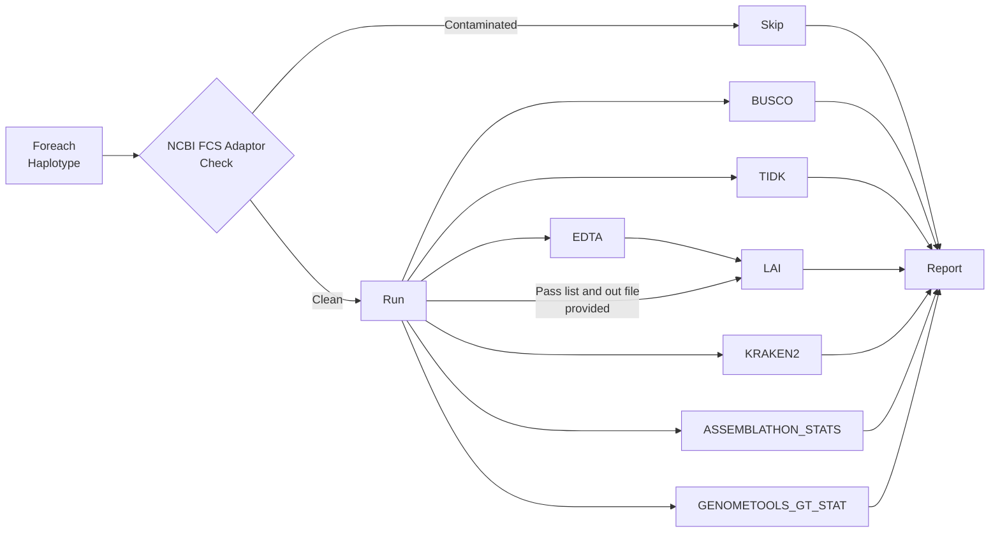

# Assembly QC Report Generator

## Table of Contents

- [Assembly QC Report Generator](#assembly-qc-report-generator)
  - [Table of Contents](#table-of-contents)
  - [Introduction](#introduction)
  - [Pipeline Flowchart](#pipeline-flowchart)
  - [Installation](#installation)
  - [Getting sample data](#getting-sample-data)
  - [Running the Pipeline](#running-the-pipeline)
    - [Run Interactively](#run-interactively)
    - [Post the NextFlow Process to Slurm](#post-the-nextflow-process-to-slurm)
  - [Software Versions](#software-versions)
  - [Future Plans](#future-plans)
    - [Tools](#tools)
    - [User Feedback](#user-feedback)

## Introduction

Welcome to the Assembly QC report generator. This software is a Nextflow pipeline that can be used to perform BUSCO searches on fasta data and will generate an easy-to-read html report. More capabilities will be added in the future.

## Pipeline Flowchart



## Installation

1. Copy the Github repository URL and run the following in your target folder:

```bash
$ git clone https://github.com/PlantandFoodResearch/assembly_qc.git
```

2. Navigate into the project

```bash
$ cd assembly_qc/
```

## Getting sample data

In order to retrieve dummy data to test the pipeline with, run the following:

```bash
$ ml seqkit/0.7.0
$ mkdir test_data
$ cp /output/genomic/fairGenomes/Fungus/Neonectria/ditissima/sex_na/1x/assembly_rs324p/v1/Nd324_canupilon_all.sorted.renamed.fasta \
./test_data/test_data_original.fasta
$ seqkit sample -p 0.25 -s 33 ./test_data/test_data_original.fasta > ./test_data/test_data1.fasta
$ seqkit sample -p 0.25 -s 49 ./test_data/test_data_original.fasta > ./test_data/test_data2.fasta
$ rm ./test_data/test_data_original.fasta
$ cp /output/genomic/fairGenomes/Fungus/Neonectria/ditissima/sex_na/1x/assembly_rs324p/v1/augustus.hints.fixed.gff3 ./test_data/test_data1.gff3
$ cp /output/genomic/fairGenomes/Fungus/Neonectria/ditissima/sex_na/1x/assembly_rs324p/v1/augustus.hints.fixed.gff3 ./test_data/test_data2.gff3
```

## To run the QC pipeline on a new genome

Edit nextflow.config and modify the parameters accordingly:
* haplotype_fasta
* haplotype_gff3
* lineage_datasets
* augustus_species
* repeat_seq
* outdir


## Running the Pipeline

### Run Interactively

1. Load the required modules:

```bash
$ ml unload perl
$ ml apptainer/1.1
$ ml conda/22.9.0
$ ml nextflow/22.10.4
```

2. Run the pipeline:

```bash
$ nextflow main.nf -profile slurm
```

### Post the NextFlow Process to Slurm

The interactive session allows us to monitor the progress from the ssh session. However, a major disadvantage is that the NextFlow task is killed if the ssh session drops for reasons such as loss of internet connection. For log running jobs, it is a good idea to post the NextFlow task to Slurm.

```bash
cat << EOF > assembly_qc_slurm.sh
#!/bin/bash -e


#SBATCH --job-name asm_qc_${USER}
#SBATCH --time=3-00:00:00
#SBATCH --nodes=1
#SBATCH --ntasks=1
#SBATCH --cpus-per-task=1
#SBATCH --output asm_qc_${USER}.stdout
#SBATCH --error asm_qc_${USER}.stderr
#SBATCH --mem=1G

ml unload perl
ml apptainer/1.1
ml conda/22.9.0
ml nextflow/22.10.4

srun nextflow main.nf -profile slurm -resume
EOF

chmod u+x ./assembly_qc_slurm.sh

sbatch ./assembly_qc_slurm.sh
```

The test data will take around 15 minutes to run. When the pipeline has finished running you will see the output of "Complete!" in the terminal.

You will now see a results folder which will contain a file named 'report.html' and can be viewed on the [powerPlant storage server](https://storage.powerplant.pfr.co.nz).

An example report.html file can be found in the [example_report](./example_report/) folder.

---

:memo: Note: If you are using your own data, you will need to update the "haplotype_fasta" value in the nextflow.config file to match the paths to your data. To include multiple input files, simply add ["NAME", "YOUR_INPUT_FASTA"] to the haplotype_fasta parameter, separated by commas.

---

After running the pipeline, if you wish to clean up the logs and work folder, you can run the following:

```bash
$ ./cleanNXF.sh
```

## Software Versions

- NCBI-FCS-ADAPTOR: 0.4
  - Tini: 0.19.0 - git.de40ad0
- ASSEMBLATHON_STATS: [160b94c/assemblathon_stats.pl](https://github.com/KorfLab/Assemblathon/blob/160b94c1d225d8b16625d0513ccb3dd73b456f74/assemblathon_stats.pl)
- GENOMETOOLS_GT_STAT: quay.io/biocontainers/genometools-genometools:1.6.2--py310he7ef181_3
- BUSCO: quay.io/biocontainers/busco:5.2.2--pyhdfd78af_0
- TIDK: quay.io/biocontainers/tidk:0.2.31--h87f3376_0
  - SEQKIT: quay.io/biocontainers/seqkit:2.3.1--h9ee0642_0
- LAI: quay.io/biocontainers/ltr_retriever:2.9.0--hdfd78af_1
  - EDTA: quay.io/biocontainers/edta:2.1.0--hdfd78af_1
- KRAKEN2: quay.io/biocontainers/kraken2:2.1.2--pl5321h9f5acd7_2
  - KRONA: docker://nanozoo/krona:2.7.1--e7615f7

## Future Plans

### Tools

- [x] General Statistics -- [https://doi.org/10.1016/j.tig.2022.10.005](https://doi.org/10.1016/j.tig.2022.10.005), [https://github.com/KorfLab/Assemblathon](https://github.com/KorfLab/Assemblathon), Ross' version: /workspace/hrarnc/GitHub/Scriptomics/hrarnc/PerlScripts/Assembly/assemblathon_stats_v1.1.pl
- [x] Contamination Check -- [https://doi.org/10.1186/s13059-022-02619-9](https://doi.org/10.1186/s13059-022-02619-9). Added kraken2.
- [x] Add both a priori and a posteriori TIDK sequence options. See differences across https://github.com/tolkit/a-telomeric-repeat-database and http://telomerase.asu.edu/sequences_telomere.html
- [ ] Synteny Check

### User Feedback

- [x] Fix the BUSCO summary table and dropdown menu for long haplotype tags.
- [x] Pull html formatting out of BUSCO/dependencies and results_table so that the machine reading of report.json is straight forward.
- [x] Contamination first before running other checks
- [ ] TIDK fix scale (chen)
- [ ] CL options e.g for busco_lineage for non-devs
