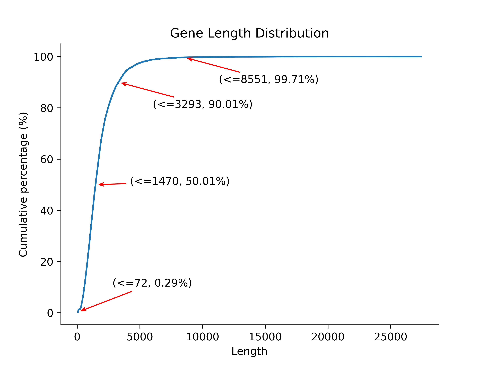
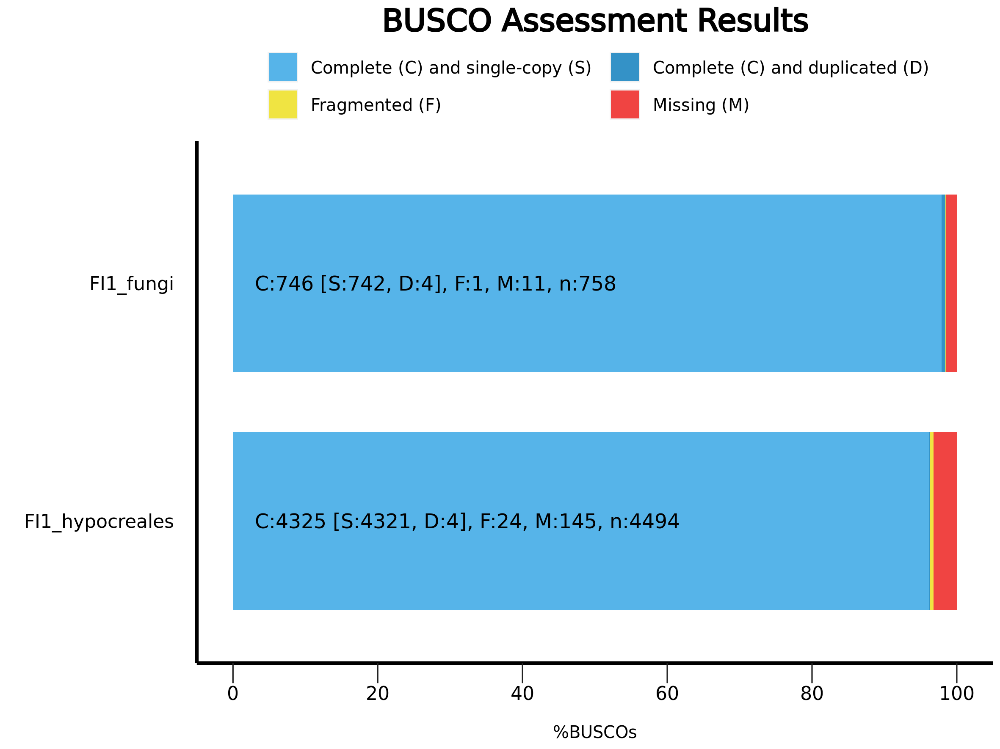
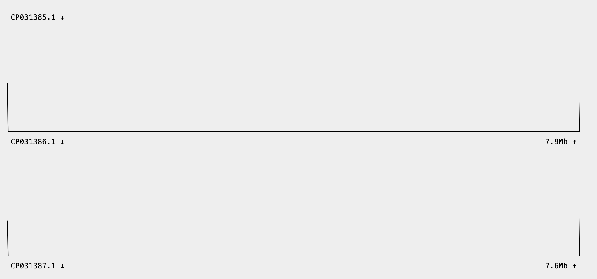
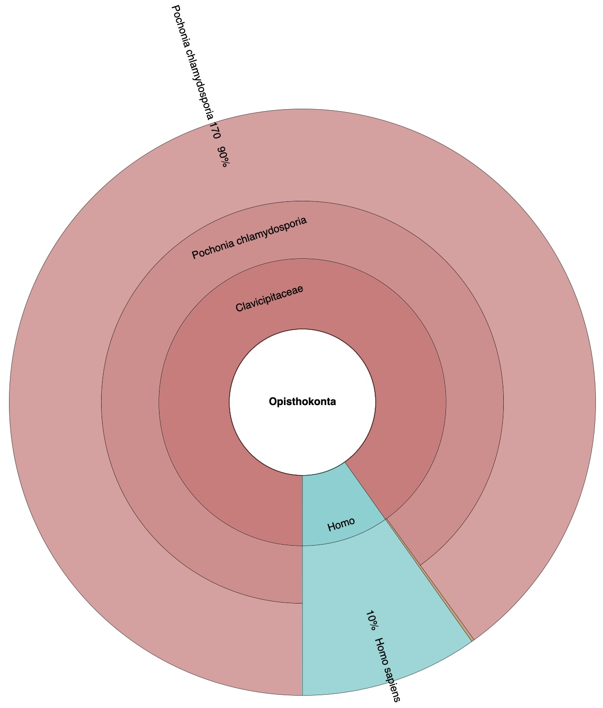
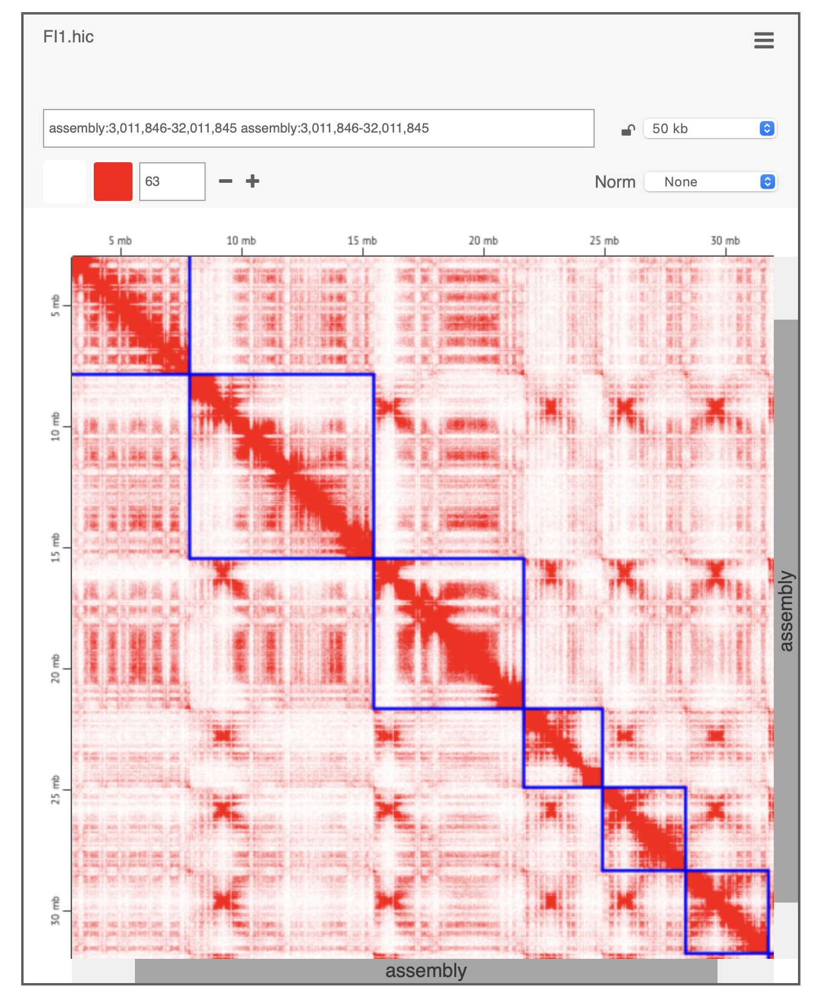
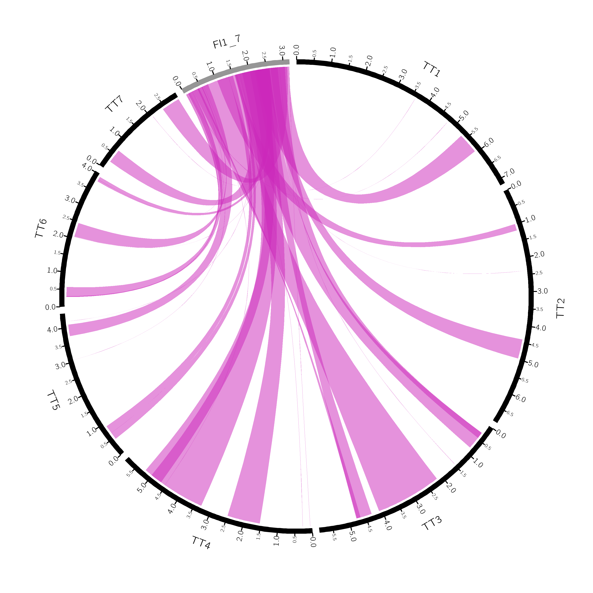
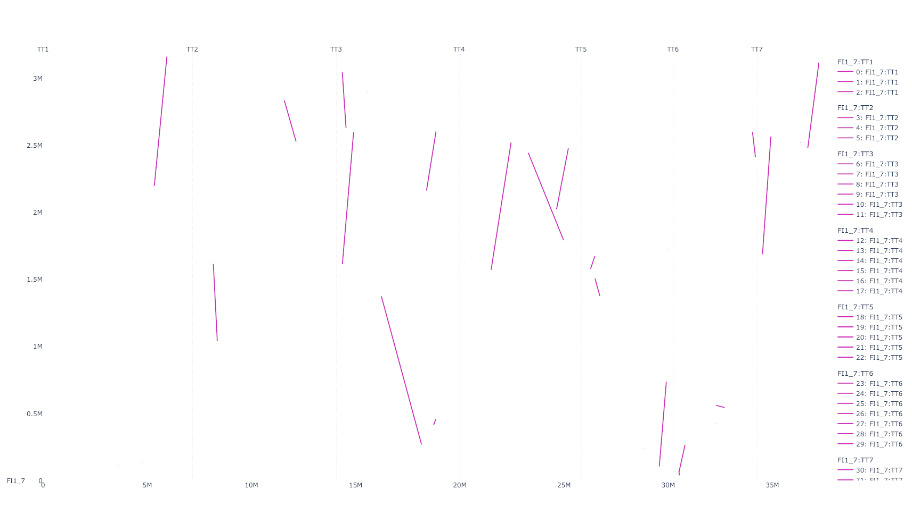
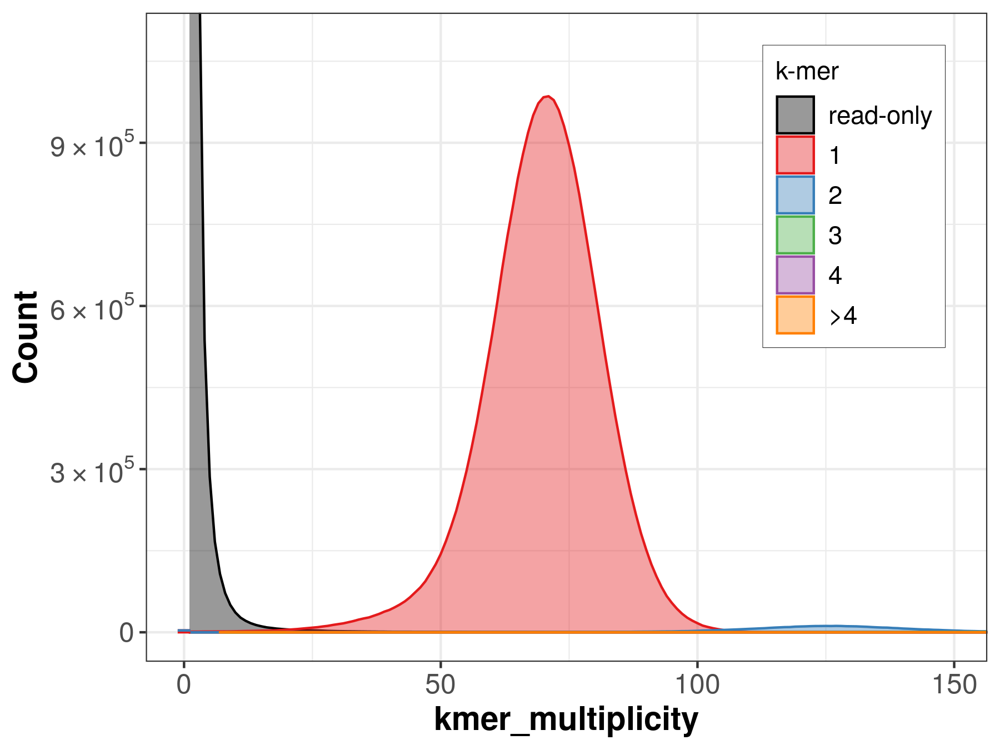

# plant-food-research-open/assemblyqc: Output

## Introduction

This document describes the output produced by the pipeline. Most of the plots are taken from the AssemblyQC report which summarises results at the end of the pipeline.

The directories listed below will be created in the results directory after the pipeline has finished. All paths are relative to the top-level results directory.

## Pipeline overview

The pipeline is built using [Nextflow](https://www.nextflow.io/) and processes data using the following steps:

<!-- no toc -->

- [FASTA and GFF3 validation](#fasta-and-gff3-validation)
- [Assemblathon stats](#assemblathon-stats)
- [Genometools gt stat](#genometools-gt-stat)
- [NCBI FCS adaptor](#ncbi-fcs-adaptor)
- [NCBI FCS GX](#ncbi-fcs-gx)
- [BUSCO](#busco)
- [TIDK](#tidk)
- [LAI](#lai)
- [Kraken2](#kraken2)
- [HiC contact map](#hic-contact-map)
- [Synteny](#synteny)
- [Merqury.FK](#merquryfk)
- [Pipeline information](#pipeline-information)

### FASTA and GFF3 validation

The pipeline prints a warning in the pipeline log if FASTA or GFF3 validation fails. The error log from the validator is reported in the `report.html`. The remaining QC tools are skipped for the assembly with invalid fasta file.

### Assemblathon stats

Output files

- `assemblathon_stats/`
  - `*_stats.csv`: Assembly stats in CSV format.

`assemblathon_stats.pl` is a script which calculate a basic set of metrics from a genome assembly.

> [!WARNING]
> Contig-related stats are based on the assumption that `assemblathon_stats_n_limit` is specified correctly. If you are not certain of the value of `assemblathon_stats_n_limit`, please ignore the contig-related stats.

### Genometools gt stat

Output files

- `genometools_gt_stat/`
  - `*.gt.stat.yml`: Assembly annotation stats in yaml format.

GenomeTools `gt stat` tool calculates a basic set of statistics about features contained in GFF3 files.

<em>AssemblyQC - GenomeTools gt stat gene length distribution</em>

### NCBI FCS adaptor

Output files

- `ncbi_fcs_adaptor/`
  - `*_fcs_adaptor_report.tsv`: NCBI FCS adaptor report in CSV format.

[FCS-adaptor detects](https://github.com/ncbi/fcs/wiki/FCS-adaptor#rules-for-action-assignment) adaptor and vector contamination in genome sequences.

### NCBI FCS GX

Output files

- `ncbi_fcs_gx/`
  - `*.taxonomy.rpt`: [Taxonomy report](https://github.com/ncbi/fcs/wiki/FCS-GX-taxonomy-report#taxonomy-report-output-).
  - `*.fcs_gx_report.txt`: A final report of [recommended actions](https://github.com/ncbi/fcs/wiki/FCS-GX#outputs).
  - `*.inter.tax.rpt.tsv`: [Select columns](../modules/local/ncbi_fcs_gx_krona_plot.nf) from `*.taxonomy.rpt` used for generation of a Krona taxonomy plot.
  - `*.fcs.gx.krona.cut`: Taxonomy file for Krona plot [created](../modules/local/ncbi_fcs_gx_krona_plot.nf) from `*.inter.tax.rpt.tsv`.
  - `*.fcs.gx.krona.html`: Interactive Krona taxonomy plot.

[FCS-GX detects](https://github.com/ncbi/fcs/wiki/FCS-GX#outputs) contamination from foreign organisms in genome sequences.

### BUSCO

Output files

- `busco/`
  - `busco_figure.png`: Summary figure created from all the BUSCO summaries.
  - `tag`
    - `short_summary.specific.*_odb10.tag_*.txt`: BUSCO summary for the assembly represented by `tag`.

[BUSCO estimates](https://busco.ezlab.org/busco_userguide.html) the completeness and redundancy of processed genomic data based on universal single-copy orthologs.

<em>AssemblyQC - BUSCO summary plot</em>

### TIDK

Output files

- `tidk/`
  - `*.apriori.tsv`: Frequencies for successive windows in forward and reverse directions for the pre-specified telomere-repeat sequence.
  - `*.apriori.svg`: Plot of `*.apriori.tsv`
  - `*.tidk.explore.tsv`: List of the most frequent repeat sequences.
  - `*.top.sequence.txt`: The top sequence from `*.tidk.explore.tsv`.
  - `*.aposteriori.tsv`: Frequencies for successive windows in forward and reverse directions for the top sequence from `*.top.sequence.txt`.
  - `*.aposteriori.svg`: Plot of `*.aposteriori.tsv`.

TIDK toolkit is designed to [identify and visualize](https://github.com/tolkit/telomeric-identifier) telomeric repeats for the Darwin Tree of Life genomes.

<em>AssemblyQC - TIDK plot</em>

### LAI

Output files

- `lai/`
  - `*.LAI.log`: Log file from LAI
  - `*.LAI.out`: Output file from LAI which lists assembly index by contig and for the whole genome.
  - `*.LTRlib.fa`: Long terminal repeat library generated by LTR_retriever.
  - `*.restored.ids.gff3`: Long terminal repeat annotation generated by LTR_retriever.
  - `*.short.ids.tsv`: LTR_retriever and LAI require that the assembly sequence IDs are alphanumeric and not more than 13 characters long. If needed, the pipeline shortens these IDS. The new and original IDs are listed in this TSV file.

LTR Assembly Index (LAI) is a reference-free genome metric that [evaluates assembly continuity](https://doi.org/10.1093/nar/gky730) using LTR-RTs. LTR retrotransposons (LTR-RTs) are the predominant interspersed repeat that is poorly assembled in draft genomes. Correcting for LTR-RT amplification dynamics, LAI is independent of genome size, genomic LTR-RT content, and gene space evaluation metrics such as BUSCO. LAI = Raw LAI + 2.8138 × (94 – whole genome LTR identity). The LAI is set to 0 when raw LAI = 0 or the adjustment produces a negative value. Raw LAI = (Intact LTR element length / Total LTR sequence length) \* 100

### Kraken2

Output files

- `kraken2/`
  - `*.kraken2.report`: [Kraken2 report](https://github.com/DerrickWood/kraken2/wiki/Manual#output-formats).
  - `*.kraken2.cut`: [Kraken2 output](https://github.com/DerrickWood/kraken2/wiki/Manual#output-formats).
  - `*.kraken2.krona.cut`: [Select columns](../modules/local/kraken2_krona_plot.nf) from `*.kraken2.cut` used for generation of a Krona taxonomy plot.
  - `*.kraken2.krona.html`: Interactive Krona taxonomy plot.

Kraken2 [assigns taxonomic labels](https://ccb.jhu.edu/software/kraken2/) to sequencing reads for metagenomics projects. Further reading regarding performance of Kraken2: <https://doi.org/10.1099/mgen.0.000949>

<em>AssemblyQC - Interactive Krona plot from Kraken2 taxonomy</em>

### HiC contact map

Output files

- `hic/`
  - `fastqc_raw/`
    - `*_1_fastqc.html/*_2_fastqc.html`: FASTQC html report for the raw reads
    - `*_1_fastqc.zip/*_2_fastqc.zip`: FASTQC stats for the raw reads
  - `fastp/`
    - `*.fastp.html`: FASTP HTML report
    - `*.fastp.json`: FASTP statistics in JSON format
    - `*.fastp.log`: FASTP log
    - `*_1.fastp.fastq.gz/*_2.fastp.fastq.gz`: Reads passed by FASTP
    - `*_1.fail.fastq.gz/*_2.fail.fastq.gz`: Reads failed by FASTP
  - `fastqc_trim/`
    - `*_1_fastqc.html/*_2_fastqc.html`: FASTQC html report for the reads passed by FASTP.
    - `*_1_fastqc.zip/*_2_fastqc.zip`: FASTQC stats for the reads passed by FASTP.
  - `hicqc`
    - `*.on.*_qc_report.pdf`: HiC QC report for reads mapped to an assembly.
  - `assembly/`
    - `*.agp.assembly`: AGP assembly file listing the length of each contig in the assembly.
  - `bedpe/` - `*.assembly.bedpe`: `*.agp.assembly` file converted to BEDPE to highlight the contigs on the HiC contact map.
  

Hi-C contact mapping experiments measure the frequency of physical contact between loci in the genome. The resulting dataset, called a “contact map,” is represented using a [two-dimensional heatmap](https://github.com/igvteam/juicebox.js) where the intensity of each pixel indicates the frequency of contact between a pair of loci.

<em>AssemblyQC - HiC interactive contact map</em>

### Synteny

Output files

- `synteny/`
  - `*.*.all/`: Synteny files corresponding to all contigs of the target assembly with respect to all contig of the reference assembly.
    - `*.on.*.all.png/svg`: Synteny plot generated with CIRCOS.
    - `*.on.*.all.png/svg`: Synteny plot generated with Plotly.
    - `bundled.links.tsv`: Bundled links file generated with MUMMER, `MUMMER/dnadiff.pl` and [bundlelinks.py](../bin/bundlelinks.py).
    - `circos.conf`: CIRCOS configuration file used to generate the synteny plot.
    - `karyotype.tsv`: Karyotype TSV file used to generate the synteny plot.
  - `*.on.*.*`: Synteny files corresponding to a single contig of the target assembly with respect to all contigs of the reference assembly.
  

[Circos](https://circos.ca) and linear synteny plots are created from genome-wide alignments performed with [MUMMER](https://github.com/mummer4/mummer?tab=readme-ov-file) and [`dnadiff.pl`](https://github.com/mummer4/mummer/blob/master/scripts/dnadiff.pl).

<em>AssemblyQC - Circos synteny plot</em>

<em>AssemblyQC - Linear synteny plot</em>

### Merqury.FK

Output files

- `merquryfk/`
  - `tag1-and-tag2-reads-*`: Results folder for haplotype `tag1` and `tag2`.
    - `*.completeness.stats`: Assembly completeness statistics
    - `*.qv`: Assembly consensus quality QV statistics
    - `*.*.spectra-cn.fl.png`: Spectra-cn plot
    

[MERQURY.FK](https://github.com/thegenemyers/MERQURY.FK) is used for the k-mer analysis.

<em>AssemblyQC - Spectra-cn plot</em>

### Pipeline information

Output files

- `pipeline_info/`
  - Reports generated by Nextflow: `execution_report.html`, `execution_timeline.html`, `execution_trace.txt` and `pipeline_dag.html`.
  - Reports generated by the pipeline: `pipeline_report.html`, `pipeline_report.txt` and `software_versions.yml`. The `pipeline_report*` files will only be present if the `--email` / `--email_on_fail` parameter's are used when running the pipeline.
  - Parameters used by the pipeline run: `params.json`

[Nextflow](https://www.nextflow.io/docs/latest/tracing.html) provides excellent functionality for generating various reports relevant to the running and execution of the pipeline. This will allow you to troubleshoot errors with the running of the pipeline, and also provide you with other information such as launch commands, run times and resource usage.
